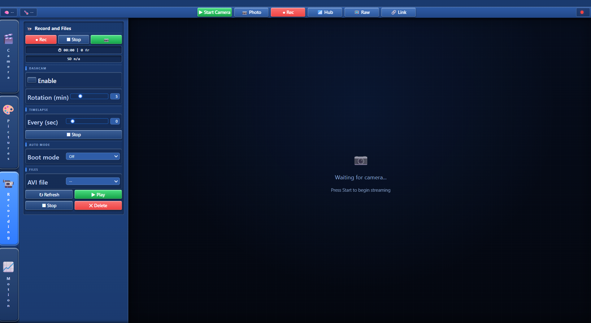
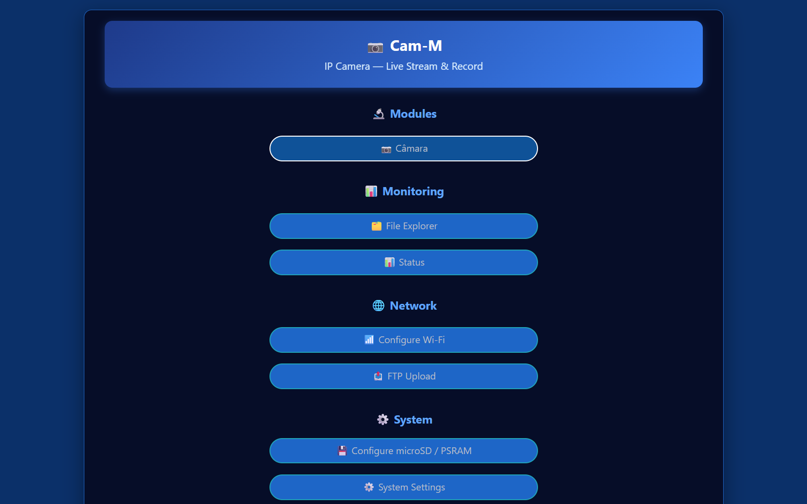

# Cam-M

**Camera companion firmware for ESP32-S3 N16R8** — part of the [Node32-HUB](https://github.com/nasp2000/Node32-HUB) project.

> ⚠️ Current release targets **ESP32-S3 N16R8 only**.

Live camera unit (OV2640/OV3660/OV5640, DVP) with MJPEG streaming, snapshots to SD, AVI recording, dashcam auto-rotation, timelapse, and a grayscale-diff motion detector with a configurable action (record video / snap photo). The web UI runs entirely in the browser — the ESP32 only captures and streams JPEG frames.

<table>
  <tr>
    <td width="50%"></td>
    <td width="50%"></td>
  </tr>
</table>

📷 [Screenshots](image/)

---

## Features

### Camera
- **MJPEG live stream** — up to 2 simultaneous viewers (`/cam/stream`), zero-copy streaming from the PSRAM frame cache
- **Snapshot** — one-tap JPEG to SD (`/CAM/PHOTOS/…`) or a direct capture
- **AVI recording** — background writer with adaptive SD flush, ISO dated folders (`/CAM/YYYY-MM-DD/`), pending staging until NTP sync
- **DashCam** — automatic loop rotation every N minutes
- **Timelapse** — periodic capture appended into a 10 fps AVI
- **Motion detection** — grayscale diff on a 40×30 grid, with sensitivity / confirm / stop / cooldown / ROI controls and action = record video or snap photo
- **Auto-start** — choose a boot mode: off / photo / video / motion / timelapse

### Web UI (`/camera`)
- Live view with heap, board temperature and real stream-FPS status pills
- Presets: HD / VGA / Fast / Night / Safe / Eco
- Resolution up to the detected sensor max (5MP module capped accordingly), quality, FPS, gain ceiling, special effects and white balance
- Picture settings: brightness / contrast / saturation, AE level, AGC gain, AEC value, mirror / flip, AWB / AEC / AGC / LCNR toggles
- Record tab: recording, dashcam, timelapse, auto-start mode, SD free space
- Motion tab: sensitivity, confirm/stop frames, post-record, cooldown, ROI, action, live motion score and diff visualisation (`/cam/motion/diff`)
- Full-screen raw view for a second screen (`/cam/raw`)

### Network & storage
- Wi-Fi AP + station with HTTP Basic Authentication
- **SD card storage** — photos, videos and timelapses under `/CAM/…`
- **File manager** and SD card pages + **FTP client** uploads
- **Monitor page** — live web serial/status monitor
- NTP time sync, OTA updates, watchdog timer and crash recovery

---

## Hardware Recommendation

[**ESP32-S3 CAM N16R8**](https://www.aliexpress.com/w/wholesale-esp32-s3-cam-n16r8.html) — with onboard camera module and micro SD card slot.

The only tested class of board. Resolution is bounded by the fitted sensor: OV3660 (3MP) up to 2048×1536 QXGA, OV5640 (5MP) up to 2592×1944. The onboard SD card uses the standard N16R8 SDMMC pins and is handled automatically.

---

## Quick start

1. Flash the pre-built binary to your ESP32-S3 N16R8 (binaries in Releases) using [webflasher_Node32-HUB](https://github.com/nasp2000/webflasher_Node32-HUB). For future updates use **OTA** at `http://<esp32-ip>/ota`
2. Power the board — it boots into AP mode (or joins your Wi-Fi if already configured)
3. Open `http://cam-m.local/camera` in a browser (mDNS — follows the System Name) or `http://<esp32-ip>/camera`, and log in (default `root`/`root`)
4. Click **Start** — the live view appears; tweak presets / resolution / motion in the side panels

---

## First Access

1. Flash the pre-built binary
2. Wait for AP **NODE32-HUB**
3. Connect with password **12345678**
4. Browse to `http://192.168.4.1`
5. Login with user **root** / password **root**
6. Go to **Settings → Wi-Fi** and connect to your local network
7. Once connected, the AP turns off automatically and the device is reachable at `http://cam-m.local` (mDNS — follows the System Name) or the assigned IP

> If the device loses connection to the Wi-Fi network, it reactivates AP mode automatically.

---

## License

Released under the MIT License — see [LICENSE](https://github.com/nasp2000/Node32-HUB/blob/main/LICENSE) in the main repository. This firmware links LGPL-2.1/LGPL-3.0 libraries; see [THIRD_PARTY_NOTICES](https://github.com/nasp2000/Node32-HUB/blob/main/THIRD_PARTY_NOTICES).